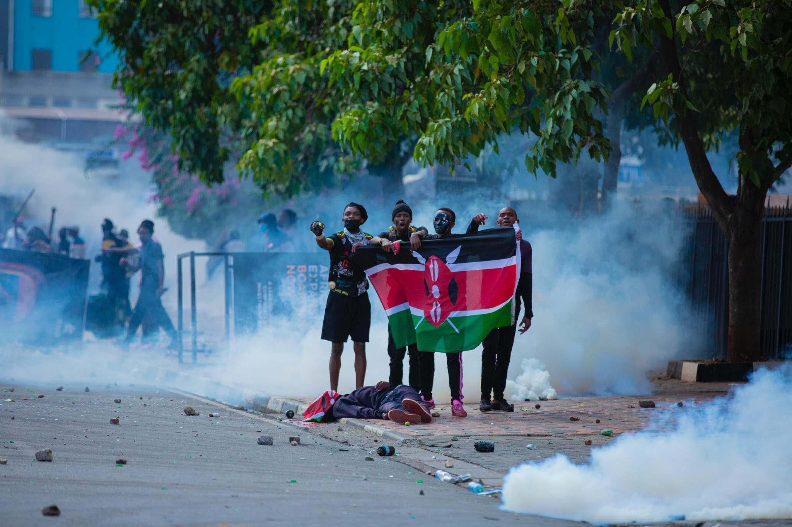

# June 2024 Protests

## Overview

In June 2024, a series of protests took place across various cities, driven by a range of social, economic, and political issues that resonated with a large portion of the population.

## Key Events

- **13 May to June 18, 2024**:
 Proposed bill in Parliament that would increase taxes Corruption Alleged detentions of critics

- **18 - 19 June , 2024**: 

The first day of protests saw hundreds of Kenyans take to the streets of the capital, Nairobi, to demonstrate against the bill. They urged members of parliament to vote against the bill in the passing of the 2nd reading held on 20 June 2024. In what was largely a peaceful protest, Kenyans, whose original intention was to sit outside the parliament buildings were thwarted by the police who lobbied tear gas canisters at them. Nairobi Police Commander Adamson Bungei stated that no group had been granted permission to protest.210 people were arrested, and tear gas was used by police. Concerns about looting led to the temporary closure of multiple businesses.Despite these arrests, demonstrations and a planned sit-in outside parliament buildings continued.The Law Society of Kenya and human rights organizations in Nairobi and across the world condemned the violence of police against the protesters. Journalists were also assaulted in the protests, leading to condemnation from the Media Council of Kenya and several media outlets in Kenya.In spite of the violence, there were no deaths on either side on the first day of protests.

- **June 20, 2024**: 

Rex Masai and other protestors are shot, which led to a series of seven days of rage from `june 21 to june 27`

- **June 25, 2024**: 

Main article: 2024 storming of the Kenyan Parliament

Protesters, numbering in thousands, managed to break through police barricades and entered the parliamentary complex. Amnesty International Kenya reported that police fired live rounds, injuring many protesters. In the chaos, a section of Parliament housing offices was set on fire, further escalating the situation. Heavy gunfire from police officers continued as they struggled to control the defiant crowd.

President Ruto `(zakayo/kasongo)` later denounced the protests, calling them "treasonous."The Ministry of Defence stated that the military had been deployed to support the police.

### for further timeline update visit the following link;

https://en.wikipedia.org/wiki/Kenya_Finance_Bill_protests

## Causes

The protests were fueled by several factors, including but not limited to:

- Economic inequality
- Political corruption
- Social injustice

## Impact

The June 2024 protests had a significant impact on the country, leading to:

- Policy changes
- Increased political engagement
- Social reforms

## Conclusion

The June 2024 protests were a pivotal moment in the country's history, highlighting the power of collective action and the importance of addressing underlying societal issues.

## NB:
To run this project locally clone this repo then use 
`python3 -m http.server 8000`

This project is also done with the help of AI `(Blackbox-AI)` incase of any error submit a pull request or use m email to fix the errors.